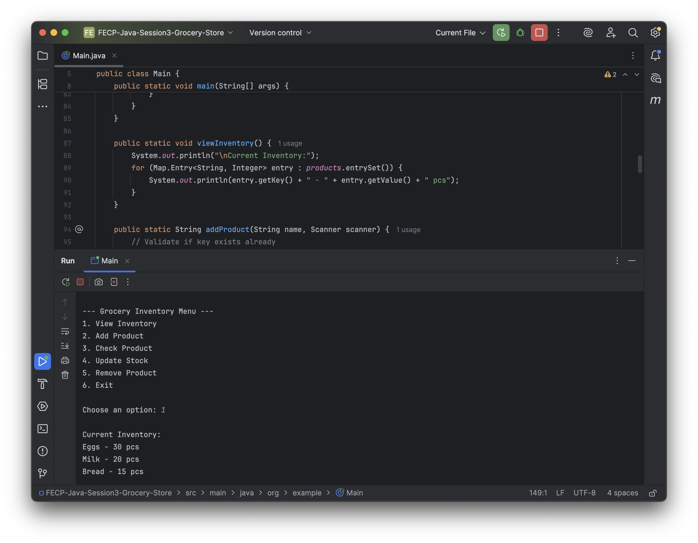
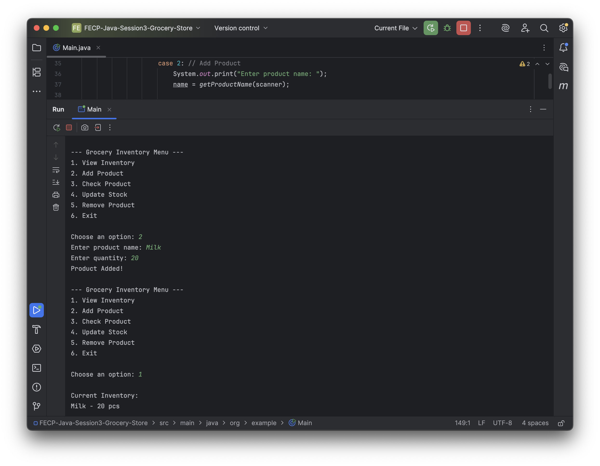
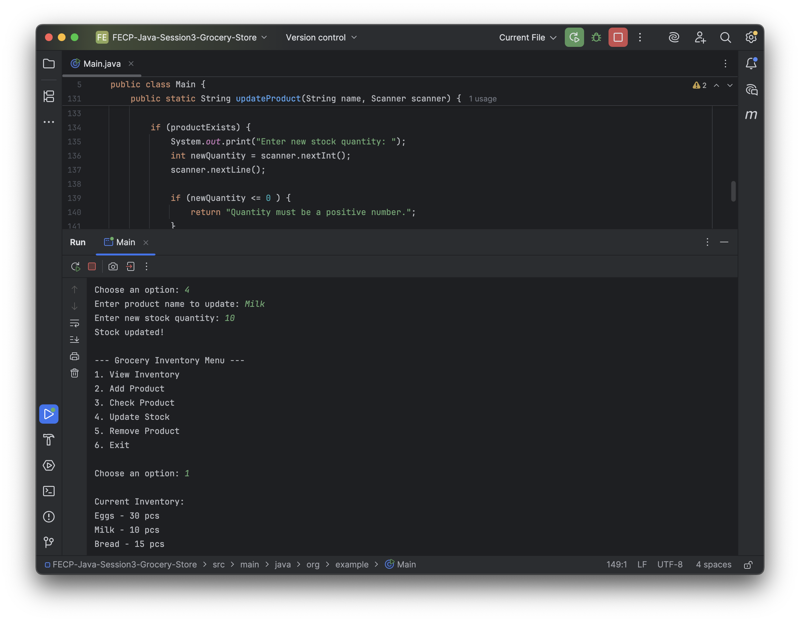
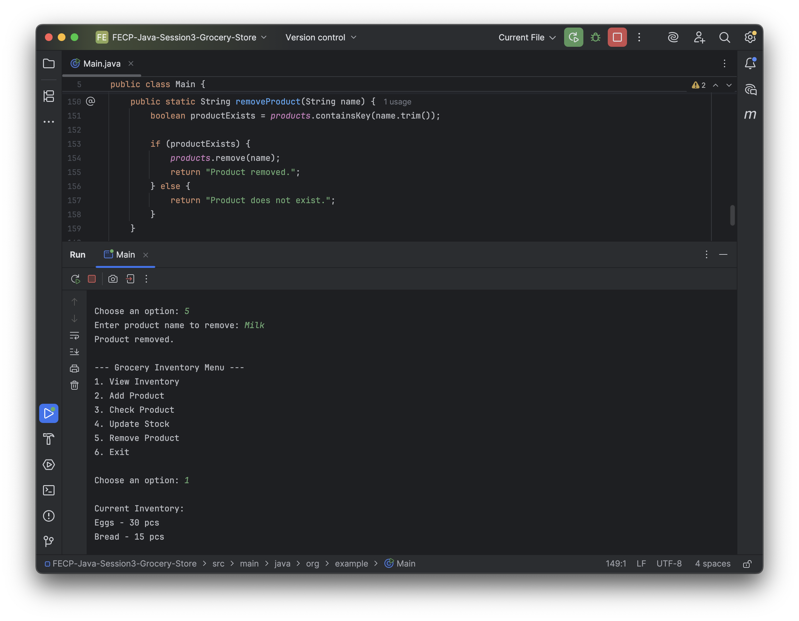
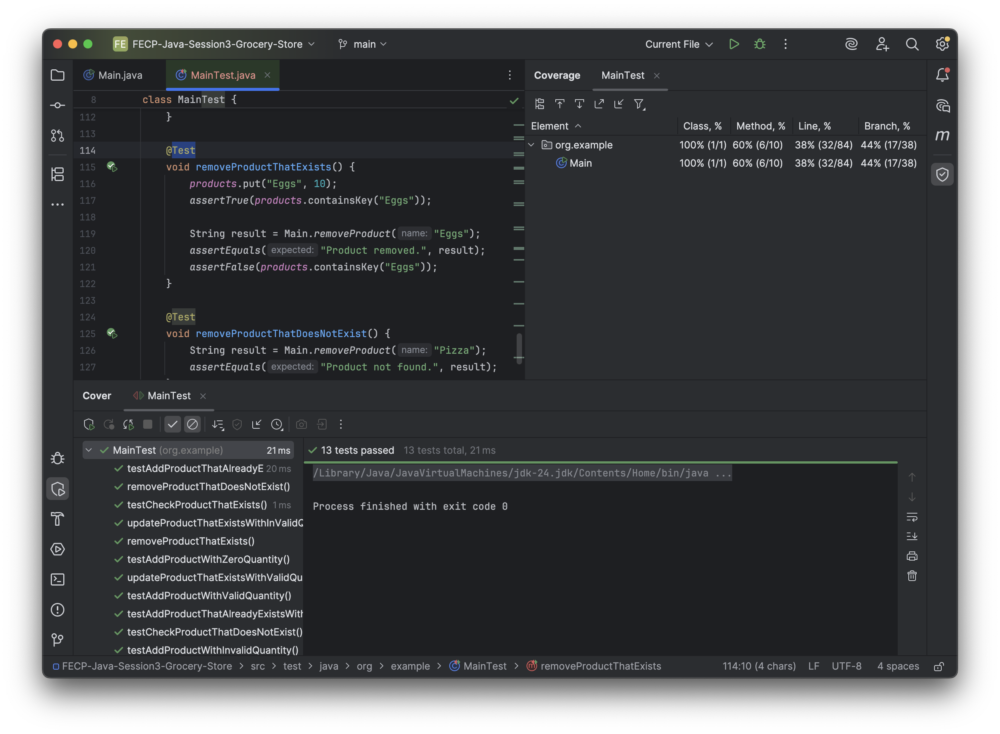

Nadeline A. Ricafranca

Lab 1: Grocery Store Inventory System

Screenshots of the Output:
* View Inventory 

* Add Product 

* Check Product 

* Update Stock 

* Remove Product 

* Unit Testing Output and Coverage 